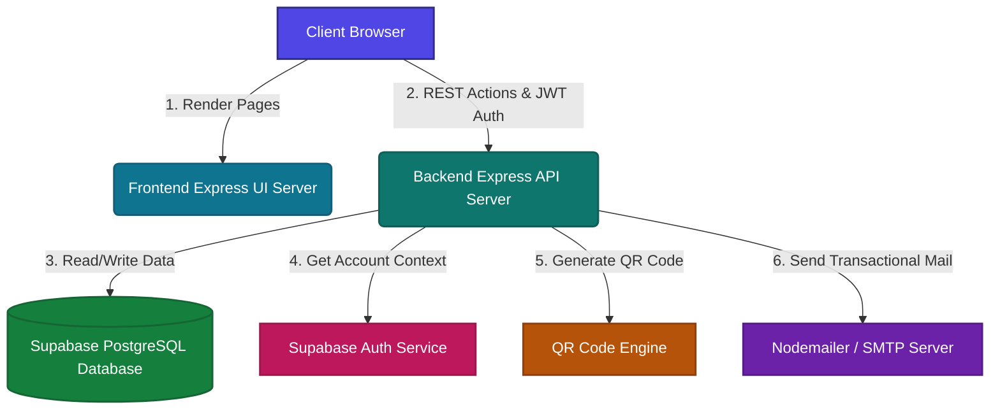
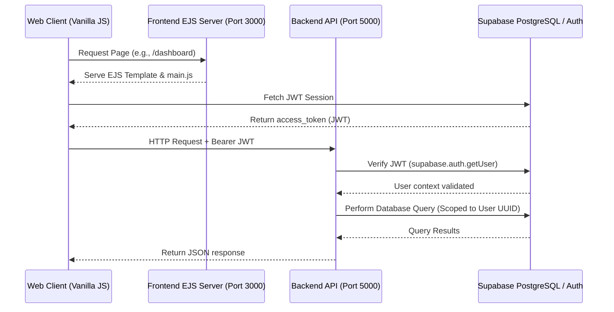
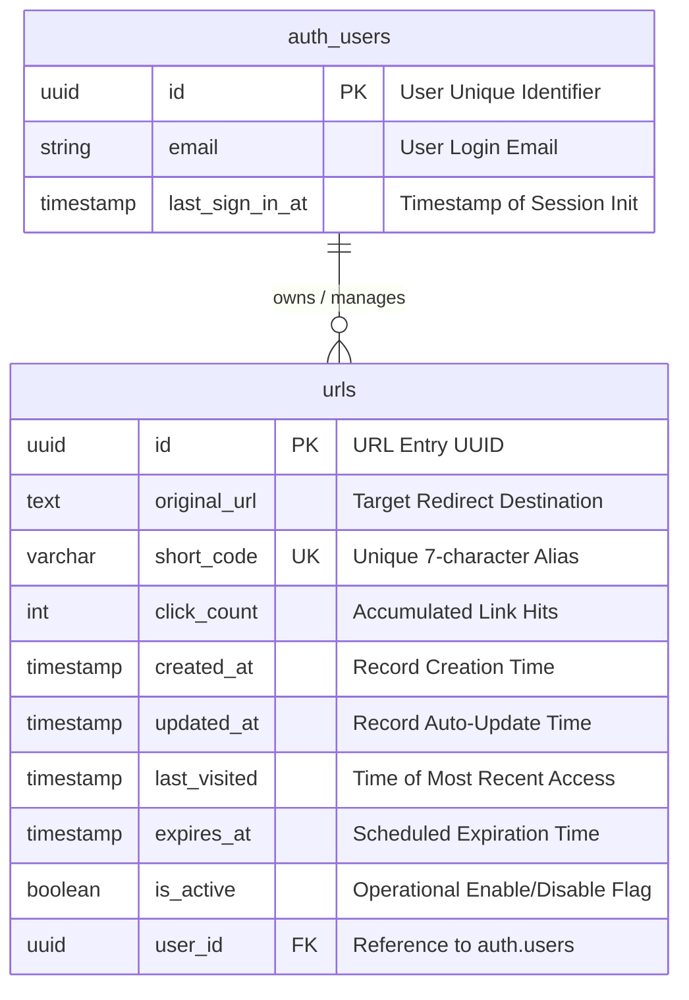
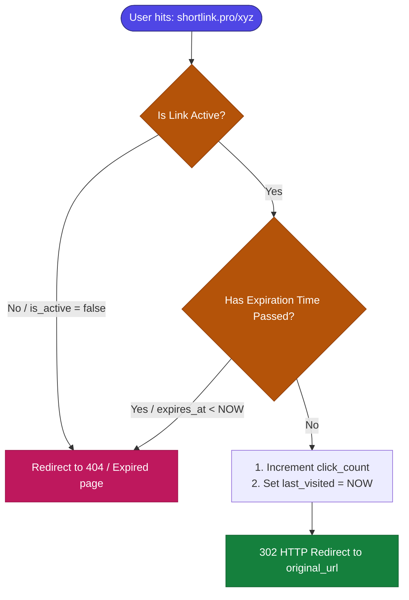
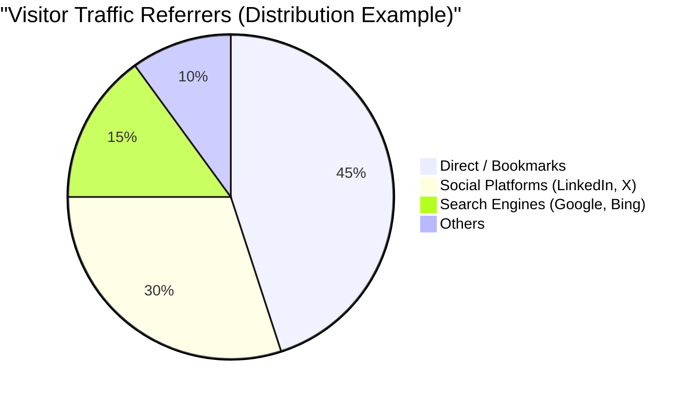

# 🔗 ShortLink Pro — Enterprise-Grade URL Shortener Ecosystem

> **ShortLink Pro** is a modern, production-ready, full-stack URL shortener and link management system. Engineered with a **fully decoupled architecture**, it isolates the high-performance REST API backend from the EJS-templated frontend. Backed by **Supabase PostgreSQL** and **JWT Authentication**, it provides comprehensive link controls, automated QR code generation, real-time analytics, and enterprise-grade security filters.

<p align="center">
  
  
  
  
  
  
</p>

---

## 🏗️ System Architecture & Workflow

The architecture is built on absolute separation of concerns. The frontend acts purely as a presentation layer, serving pages and executing client-side scripts, while the backend API serves JSON payloads, executes business logic, and communicates with Supabase.

### 1. Data Flow & System Layers


### 2. JWT Authentication & Request Pipeline


---

## 🗄️ Database Architecture & Relational Schema

ShortLink Pro uses **Supabase PostgreSQL** optimized for performance and security. The schema utilizes Foreign Keys referencing Supabase Auth users, custom Pl/pgSQL triggers, and specialized performance indexes.

### 1. Database Entity-Relationship (ER) Diagram


### 2. Indexes & Performance Optimization
To maintain sub-millisecond query response times in production, the following indexes are deployed:
- **`idx_urls_short_code`**: Speeds up direct 302 redirection lookups.
- **`idx_urls_user_id`**: Accelerates dashboard retrieval query performance.
- **`idx_urls_search_original`** & **`idx_urls_search_code`**: `GIN` indexes with Trigram support (`pg_trgm`) to enable high-speed fuzzy searches over long URLs and alias codes.

---

## 🔄 Link Redirection & Lifecycle Flowchart

The backend implements a multi-step validation engine on incoming redirection requests to ensure expired or deactivated links are safely handled.



---

## 📊 Analytics Dashboard Mockup (Data Insights)

The frontend visualizes dynamic click statistics for each link. Below is a representation of typical metrics tracked by our analytical queries:



---

## 🌟 Premium Features

### 👤 User Lifecycle & Authentication
- **Secure Sessions**: Powered by Supabase Auth, offering signup, verification, secure logins, password resets, and logout sequences.
- **Transactional Welcome Emails**: Automatic dispatch of welcome onboarding emails using Nodemailer with support for local Ethereal fallback and external SMTP services (like Brevo).

### ⚙️ Link Customization & Configuration
- **Custom Aliases**: Users can specify customized short codes (e.g., `/my-promo`) for branded marketing.
- **Expiration Scheduler**: Enforce link expiration dates and times with a precise calendar selector.
- **Active / Inactive Toggles**: Toggle link availability instantly from the dashboard to enable/disable redirects.

### 📊 Real-Time Analytics & QR Engine
- **Visitor Monitoring**: Tracking click-through counters, creation dates, and UTC last-visited timestamps.
- **Automatic QR Codes**: Automatic base64 QR code generation for every created link.
- **Instant High-Res Downloads**: In-dashboard capability to download generated QR codes instantly.

### 🔒 Enterprise Protection & Performance
- **Port Isolation**: Segregated operations: UI runs on Port `3000`, API operates on Port `5000`.
- **CORS Whitelisting**: Lock API requests strictly to trusted origins.
- **Rate-Limiting Schemas**: Strict rate limiting to block API spam (100 requests / 15 mins) and URL creation abuse.

---

## 📁 Repository Anatomy

The repository contains two isolated Node.js modules:

```
ShortLink-Pro/
│
├── backend/                    # Core REST API Service
│   ├── database/
│   │   └── setup.sql           # Database schema, performance indexes, and RLS policies
│   ├── src/
│   │   ├── config/             # Config loader & database clients
│   │   ├── controllers/        # Core business operations (URL creation, redirection, analytics)
│   │   ├── middleware/         # CORS filters, JWT verification, validation schemas, rate limiters
│   │   ├── models/             # Database access abstractions using Supabase JS client
│   │   ├── routes/             # Router mappings (REST endpoints & redirection handlers)
│   │   ├── services/           # Helper services (QR generation, welcome emails)
│   │   └── app.js              # Express middleware and routing assembly
│   ├── server.js               # Service Entry (Port 5000)
│   ├── package.json
│   ├── .env.example
│   └── README.md               # Backend documentation
│
├── frontend/                   # Client-Facing Interface
│   ├── public/
│   │   ├── css/
│   │   │   └── style.css       # Responsive custom glassmorphism stylesheets
│   │   └── js/
│   │       └── main.js         # API integration client-side application logic
│   ├── src/
│   │   └── views/              # EJS server-rendered HTML templates
│   ├── server.js               # Service Entry (Port 3000)
│   ├── package.json
│   ├── .env.example
│   └── README.md               # Frontend documentation
│
└── README.md                   # Workspace Root Documentation (this file)
```

---

## ⚙️ Quick Start

Follow these steps to deploy and run the workspace locally:

### 1. Database Provisioning
1. Sign up on [Supabase](https://supabase.com) and spin up a new PostgreSQL project.
2. In the **SQL Editor**, paste and run the contents of [setup.sql](file:///c:/Users/JBC/Desktop/URL%20Shortner/backend/database/setup.sql) to provision the `urls` table, indexing columns, and security configurations.

### 2. Backend Initialization
```bash
# Move to backend folder
cd backend

# Install production and development dependencies
npm install

# Setup environment configuration
cp .env.example .env
```
Edit the `.env` file and populate it with your database credentials:
```env
PORT=5000
NODE_ENV=development
BASE_URL=http://localhost:5000
TZ=Asia/Kolkata
FRONTEND_URL=http://localhost:3000
SUPABASE_URL=your_supabase_project_url
SUPABASE_ANON_KEY=your_supabase_anon_public_key
```
Start the API server:
```bash
npm run dev
```

### 3. Frontend Initialization
Open a new terminal window at the project root and run:
```bash
# Move to frontend folder
cd frontend

# Install dependencies
npm install

# Setup environment configuration
cp .env.example .env
```
Edit `.env` and verify the backend API address:
```env
PORT=3000
NODE_ENV=development
TZ=Asia/Kolkata
BACKEND_URL=http://localhost:5000
```
Start the frontend web application:
```bash
npm run dev
```
Open **[http://localhost:3000](http://localhost:3000)** in your browser! 🚀

---

## 🔌 API Endpoints Reference

All API responses enforce a consistent JSON structure:
```json
{
  "success": true,
  "message": "Action completed successfully",
  "data": { ... }
}
```

### URL Management API (`/api/urls`)
| Method | Endpoint | Auth Required | Description |
| :--- | :--- | :--- | :--- |
| **POST** | `/api/urls/shorten` | Optional | Creates a random short-code URL. |
| **POST** | `/api/urls/custom` | Optional | Creates a URL with a custom short alias code. |
| **GET** | `/api/urls` | **Yes** | Fetches paginated URLs owned by the current user. |
| **GET** | `/api/urls/search` | **Yes** | Fuzzy searches URLs using terms matching URL or short-code. |
| **GET** | `/api/urls/:id` | **Yes** | Fetches detailed metadata for a single URL record. |
| **PUT** | `/api/urls/:id` | **Yes** | Updates target URL, expiration time, or active state. |
| **DELETE**| `/api/urls/:id` | **Yes** | Permanently deletes a URL record from database. |
| **GET** | `/api/urls/analytics/:shortCode` | **Yes** | Retrieves analytics metrics and base64 QR string. |

### Redirection & System API
| Method | Endpoint | Auth Required | Description |
| :--- | :--- | :--- | :--- |
| **GET** | `/:shortCode` | No | Resolves the code, increments clicks, and issues `302 Redirect`. |
| **POST** | `/api/welcome` | No | Dispatches onboarding welcome emails for signup. |
| **GET** | `/health` | No | Simple API service health check. |

---

## 🛡️ Security & Development Best Practices

- **Strict Validation Pipelines**: Every request body parameter is parsed and sanitized by `express-validator` to guarantee structural sanitization before reaching the database.
- **SQL Injection Prevention**: Supabase Javascript Client acts as a secure parameterization engine preventing SQL injection vectors.
- **Row Level Security (RLS)**: Row-Level Security policies are activated in the database to prevent cross-tenant information access.
- **Clean Timezone Alignment**: Local calendar expirations and server comparisons are synced to the `Asia/Kolkata` time database context to ensure consistent operations.
- **Production CORS Locking**: Origin checks lock access to specified production frontend URLs, shielding backend endpoints from external domains.
